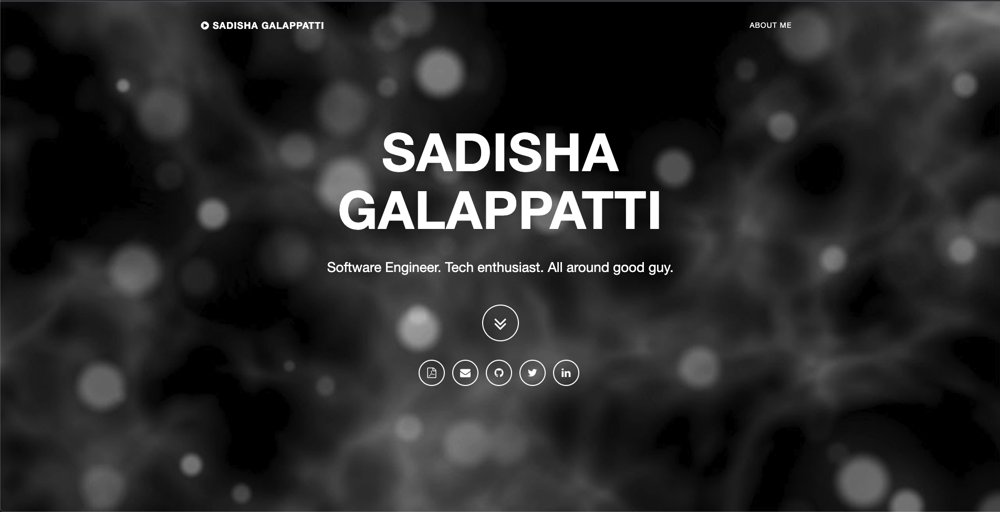

# Development REPO for sadishag.github.io

> Hosted at sadishagalappatti.ca

## Background

It's been years since I built my first ever personal portfolio/resume website. I remember being a 4th year software engineering student at McMaster University getting ready to go to CUSEC (Canadian University Software Engineering Conference) when it occured to me that I was going to a networking conference without nice looking site to host my resume and contact information. So I did what any other budding software developer would do, copy code from the internet and frankenstein it together until it worked. This hodge podge of a website ended up looking ok, and it had nice looking icons which linked to my resume, email, linkedin, etc. It looked a bit like this:

Not too bad, but after I graduated and started gaining more real world experience - this just didn't really seem to show it.

Now I'm not the most frontend savvy software developer but I do know my way around react well enough to rebuild a much better, simple website to showcase my experience in the tech industry.

## Site Details

| Environment | URL + Path                                          | Github REPO                                                                  | Description                                                                              |
| ----------- | --------------------------------------------------- | ---------------------------------------------------------------------------- | ---------------------------------------------------------------------------------------- |
| DEV/QA      | https://sadishagalappatti.ca/dev.sadishag.github.io | [dev.sadishag.github.io](https://github.com/sadishag/dev.sadishag.github.io) | DEV/QA build of [sadishag.github.io](https://github.com/sadishag/sadishag.github.io)     |
| PROD        | https://sadishagalappatti.ca                        | [sadishag.github.io](https://github.com/sadishag/sadishag.github.io)         | PRODUCTION Build of [sadishag.github.io](https://github.com/sadishag/sadishag.github.io) |
